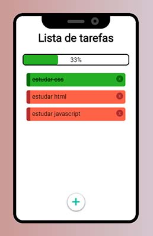

# Lista de tarefas - Vue JS

Pequeno projeto para por em prova os conhecimentos obtidos no estudo de VueJS.

## Recursos do aplicativo

- Adicionar tarefas
- Remover tarefas
- Marcar como concluída ou desmarcar
- Salvamento das tarefas no LocalStorage do navegador

### Veja online: [Github Pages](https://lucas-av7.github.io/todo-list-vuejs/)

### Algumas capturas de tela

